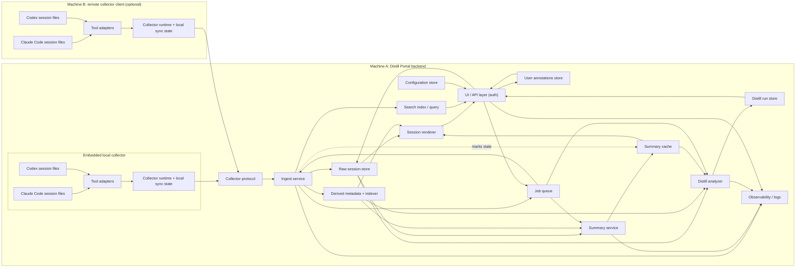

# Distill Portal Architecture

## Purpose

This document captures the v1 implementation architecture for Distill Portal.

[PRD.md](PRD.md) describes what the product is for and what users should be able to do.
This document describes how the portal should be built to support those goals.

This version makes session collection an explicit subsystem boundary.
The backend core should not depend on direct access to Claude Code or Codex session files.
Instead, all session discovery and file access should happen through a collector, whether that collector runs inside the backend machine or on a different machine.

## Architecture Principles

- Local-first storage: raw session data, indexes, summaries, and archive state live in the backend's local store.
- Collector boundary: session discovery, source-file access, and sync transport belong to a collector subsystem with an explicit contract to the backend.
- Same ingestion path everywhere: the backend ingests sessions through a single logical collector contract. Embedded local mode and remote collector mode are two transport bindings of the same contract, not two codepaths.
- Raw-first: source session artifacts are the source of truth.
- Two-tool scope: Claude Code and Codex are the only supported tools in v1.
- Tool-aware handling: each tool has its own adapter, parser, renderer, and analyzer preparation path where needed.
- Shared fields only: cross-tool consistency is limited to the fields needed for filtering, selection, and navigation.
- Machine-aware provenance: every stored session records which collector and machine supplied it. Collector identity and machine identity are backend-issued, never self-asserted by an untrusted payload.
- Derived outputs are keyed and persisted: the Summary Cache is keyed so entries survive source updates when possible and is regenerated lazily on cache miss. Persisted distill runs are durable historical records keyed by `run_id` and looked up by `selection_fingerprint`; a new fingerprint produces a fresh run rather than regenerating an old one (see §8 and §"Storage Layout").
- Replace-on-sync: the system stores the latest known session state, not a full version history.
- Explainability over cleverness: v1 analysis favors transparent heuristics with visible inputs over opaque scoring.

## Terminology

This document and `PRD.md` share the vocabulary below. When the two docs use different phrasing for the same concept, the architectural name wins.

| Term | Meaning |
| --- | --- |
| **Session** | A single conversation/run from a supported coding tool, identified by a stable tool-scoped id. Unit of ingestion, storage, and browsing. |
| **Source tool** | `claude_code` or `codex` in v1. |
| **Source session file** | The on-disk artifact the tool writes (JSONL for both supported tools). Some tools have related sidecar artifacts (for example, Claude subagent transcripts) that v1 detects but does not ingest. |
| **Collector** | A process that reads source session files on a given machine and submits them to the backend through the Collector Protocol. Exactly one logical collector per machine by default. |
| **Backend** | The portal server that runs the Ingest Service, Raw Store, Indexer, Renderer, Summary Service, Distill Analyzer, Search, and UI/API. |
| **Machine** | A physical or virtual host. Identified by a backend-issued `machine_id` at collector registration time. |
| **Shared session record** | The small, tool-agnostic record the Indexer maintains for every ingested session. Used for filtering, listing, linking; not a replacement for the raw payload. |
| **Raw payload** | The original tool-written JSONL for one session, stored content-addressed in the Raw Store. v1 does not store sidecar artifacts. |
| **Skim view / skim block / summary block** | UI terms. A **skim block** is one user message plus the agent reaction until the next user message. **Skim view** is the sequence of blocks for a session. **Summary block** and **skim block** refer to the same unit. |
| **Distill run** | One execution of the Distill Analyzer against a specific selection of sessions. |
| **Lens** | A saved filter combination the user can reopen. |
| **Project** | The folder or repository a session was worked in. The grouping field stored on the shared record is `project_path` (best-effort derived path; see §5 for derivation rules). The user-facing display name is the optional derived `project_label` (defaults to `project_path` itself, optionally collapsed via the project-alias map in Configuration). |
| **Provenance** | The latest-seen (`collector_id`, `machine_id`, `source_path`) tuple recording where a stored session most recently came from. v1 keeps only the latest provenance, not a history of every collector that observed the session. |

## High-Level Shape

The portal is organized into the following logical components:

1. Collector protocol
2. Collector runtime (with source adapters)
3. Ingest service
4. Raw session store
5. Derived metadata and indexer
6. Session renderer
7. Summary service
8. Distill analyzer
9. Search index and query
10. User annotations store
11. Configuration store
12. Job queue (async summaries, distill runs, ingest tasks)
13. UI / API layer (including authentication surface)
14. Observability and logs

The following diagram shows the intended component boundary.
Both the embedded local collector and any remote collector submit through the same collector protocol into the same ingest service. Derived artifact stores — the summary cache and the distill run store (durable historical records, not a cache; see §"Storage Layout") — are shown explicitly, as is the annotation store and the query path for the UI.



## Component Responsibilities

### 1. Collector Protocol

The collector protocol is the boundary between session collection and the backend core.

It is responsible for:

- identifying a collector instance (see "Authentication in v1" below for the v1 trust model, which does not include cryptographic authentication of remote collectors)
- associating incoming session payloads with a stable, backend-issued collector identity and machine identity
- accepting idempotent session upserts from collectors
- accepting collector health, last-seen, and sync-status updates
- allowing collectors to retry safely when the backend is temporarily unavailable

The logical contract stays the same whether the transport is in-process, loopback HTTP, or a remote network call.

#### Transport Bindings

There is one logical contract and two transport bindings:

- **In-process binding** — the embedded local collector calls the Ingest Service through a typed function interface. No sockets. This is the default for out-of-the-box local use.
- **HTTP binding** — any remote collector, or an embedded collector that the user opted into HTTP for, posts over HTTP to the backend's loopback or network listener. v1 does not require TLS on this path; users who want wire encryption front the backend with their own TLS-terminating reverse proxy (see §14 and "Deployment Modes").

Both bindings carry the same request and response types and the same idempotency rules. The backend must not skip steps (identity binding of `collector_id`/`machine_id`, fingerprint comparison, upserting the session's `fts_sessions` row, marking affected summary cache entries `stale`; persisted `distill_runs` are retained as historical records and are not modified on ingest — see §"Storage Layout" → "Cross-Component Atomicity") in either binding.

#### Endpoints

The HTTP binding's endpoints (and the equivalent in-process methods) are:

- `POST /v1/collectors:register` — one-time registration. Returns a backend-issued `collector_id` and `machine_id` bound to the source interface of the registration call. v1 does not issue an additional credential (see "Authentication in v1" below and §14 for the trust model). `machine_id` is never accepted from the payload on subsequent calls; it is bound to the registered collector.
- `POST /v1/sessions:upsert` — idempotent submit of one or more sessions. Payload carries `(tool, source_session_id, source_path, source_fingerprint, raw_blob, shared_record_hints)`. Response echoes assigned backend ids and tells the collector whether the submission changed the stored state.
- `POST /v1/collectors:heartbeat` — liveness ping plus current local sync state summary.
- `POST /v1/collectors:deregister` — explicit teardown. After deregistration, submitted sessions remain visible but are marked read-only until the collector re-registers.
- `GET /v1/collectors/{id}/cursor` — returns the last-acknowledged per-source fingerprints so the collector can skip work already accepted.

#### Payload Schema (summary)

A `sessions:upsert` entry contains, at minimum:

- `tool`
- `source_session_id` (opaque tool-scoped id; see §5)
- `source_path` (provenance, not used for grouping)
- `source_fingerprint` (last-complete-line offset + line count + last-line content hash + source mtime — robust against torn reads)
- `raw_blob` (the JSONL bytes; streamed for large sessions)
- `shared_record_hints` (proposed values for `created_at`, `project_path`, `title`, etc., that the Indexer may accept or recompute; also includes tool-specific hints such as `has_subagent_sidecars` for Claude)

Note: v1 does not carry a generic `sidecars` collection across the protocol. Claude subagent sidecar files are detected but not transmitted in v1 (see §2 "Source Adapters"); the boolean presence is exposed via `shared_record_hints.has_subagent_sidecars` only.

#### Error Semantics and Retry

- 2xx — accepted or no-op (idempotent).
- 4xx — permanent; collector should log and drop, not retry. Exception: `409` on registration conflicts, which the collector may re-try with a fresh registration request.
- 429 / 5xx — transient; collector retries with exponential backoff and jitter, capped at a bounded interval (for example 1 hour) and with a bounded queue so backpressure surfaces to the collector's local sync state.

#### Idempotency

The deduplication key on the backend is `(tool, source_session_id)` (see §5 for cross-machine handling). Resubmitting the same payload with the same `source_fingerprint` is a no-op. Resubmitting with a newer fingerprint is an update.

#### Protocol Version Negotiation

`sessions:upsert` requests and `collectors:heartbeat` responses carry a `protocol_version` (major.minor). The backend compatibility policy for v1:

- **Same major:** every minor version within the same major is accepted. The backend logs a warning when a minor-version skew is detected but ingests normally.
- **Collector major < backend major:** the backend refuses with a structured `422` response that includes an `upgrade_hint` URL and the minimum supported version.
- **Collector major > backend major:** the backend refuses with `422` and a `downgrade_hint`; this case is rare (the collector is newer than the backend).

The current major is `v1`. The compatibility window commits to not breaking the `v1` major through the entire v1 release line; any breaking change rolls to `v2`.

#### Authentication in v1

v1 deliberately ships without strong transport authentication for remote collectors. The concrete v1 rules are:

- `collectors:register` is an unauthenticated request accepted only on a configured listen interface. The user is responsible for binding the backend to a trusted network interface (loopback by default; a private/VPN interface if they choose to accept remote collectors).
- Registration returns a `collector_id` and `machine_id`. For v1, the only credential on subsequent calls is the collector submitting requests over the same channel; there is no bearer token.
- The backend records the source interface of each request and refuses requests that arrive on interfaces other than the one configured for remote collectors.
- The backend still rejects payloads that attempt to claim a different `collector_id` or `machine_id` than the one assigned at registration for the source interface's active session.

This is a deliberate simplification, accepting a "trusted private network" posture for the remote path. It is revisited as a possible v1.x hardening step (see "Open Architecture Decisions").

### 2. Collector Runtime

The collector runtime is the only subsystem allowed to read tool session files directly.

There is one collector runtime per machine whose local sessions need to be imported.
The backend machine runs one by default so the product remains simple to use locally.

The collector runtime is responsible for:

- scanning configured source locations local to that machine
- detecting new sessions and updates to existing sessions
- loading raw session data safely (see "Safe JSONL Reads" below)
- invoking the correct tool adapter
- producing the minimum shared metadata hints needed for ingestion
- shipping raw payloads plus provenance metadata to the backend through the collector protocol
- maintaining local sync state (per-session cursor) so a crash restart does not lose unpushed work
- retrying and resuming sync when the backend is temporarily unreachable

No other backend component reads Claude Code or Codex directories directly. That rule is enforced so local and remote collection share the same ingest path.

#### Source Adapters

Source adapters are the per-tool parsers layered under the collector runtime. There is one adapter for Claude Code and one adapter for Codex.

Each adapter is responsible for:

- discovering session files at a configured source location using tool-specific path conventions
- loading raw session data
- extracting shared metadata hints (tool-scoped `source_session_id`, `created_at`, `cwd`, derived `project_path`, etc.)
- exposing enough tool-specific structure — message ids, turn markers, compaction/boundary markers — to support skim-block generation, relinking after updates, and renderer logic
- not forcing sessions into a universal transcript schema

Tool-specific facts each adapter must respect (see `references/claude-code-session-storage.md` and `references/codex-session-storage.md`):

- Both tools write append-only JSONL: one JSON object per line.
- Claude Code sessions live under `~/.claude/projects/<project-key>/<session-id>.jsonl`; `<session-id>` is the authoritative tool-scoped id and also appears in each record as `sessionId`. `<project-key>` is a sanitized absolute path useful as a hint, but `cwd` inside records is the authoritative project source.
- Claude Code may write sidecar transcripts for subagents under `<session-id>/subagents/agent-<id>.jsonl` plus a `.meta.json`. **These sidecars are NOT ingested in v1.** The Claude adapter records the presence of sidecar directories as the boolean hint `has_subagent_sidecars` on the parent session's shared record (see §5) so a future release can opt in to ingesting them, but the sidecar JSONL content does not enter the Raw Store, does not appear in the renderer, and is not summarized or searched in v1.
- Codex sessions live under `~/.codex/sessions/YYYY/MM/DD/rollout-<ts>-<session-id>.jsonl`. The session id is embedded in the filename and reiterated as the first `session_meta` record. Project attribution must come from `session_meta.payload.cwd` and `turn_context.payload.cwd`, not the date-based directory path.

#### Safe JSONL Reads

Because both source tools write JSONL append-only while the agent is running, the collector must tolerate mid-write reads:

- snapshot byte length and mtime before parsing
- parse strictly line-by-line
- discard any trailing bytes that do not terminate with a newline; those bytes will be picked up on the next poll
- compute `source_fingerprint` from the last fully-terminated line offset and content hash, not from a hash of the whole file — this makes incremental-update detection robust against torn reads and cheap to recompute

#### Local Sync State

The collector persists, per source file:

- last seen byte offset and line count
- last computed fingerprint
- last submission result (accepted / rejected / pending / backoff)
- retry count and next-attempt timestamp
- consecutive-failure count and last-failure timestamp

On start or restart the collector reconciles disk state against this cursor: any file whose current fingerprint differs from the last acknowledged fingerprint is scheduled for re-submission. This is how the collector recovers from its own crash mid-sync without silently losing data.

#### Per-session Retry Ceiling

After N consecutive `failed_storage`, `507 Insufficient Storage`, or 5xx responses from the backend (default N=12 with exponential backoff), or after T wall-clock hours of unsuccessful retry (default T=24h), the collector marks the source file as `sync_blocked`:

- the file is excluded from the normal poll loop
- a structured event is emitted to the backend on the next heartbeat so the UI's health view can surface it
- the user must intervene (for example, by freeing disk space, or by clicking "retry now" in the UI) to unblock the session

This bound prevents a single broken session from saturating the collector's queue indefinitely.

### 3. Ingest Service

The ingest service is the backend entry point for collector submissions.

It is responsible for:

- receiving session payloads from collectors
- validating payload shape and binding the submission to the collector's registered identity (v1 does not cryptographically authenticate; see §14, "Collector Binding (v1)")
- refusing any payload that attempts to claim a different `collector_id` or `machine_id` than the source interface's registered collector
- deduplicating and upserting raw session state
- tracking ingest status, sync status, and collector last-seen state
- triggering re-indexing and cache invalidation when a session changes
- staying idempotent when a collector resends the same session state
- honoring purge tombstones so a purged session cannot be silently re-ingested

The ingest service does not depend on direct file access to the collector's machine.

#### Crash Recovery and Transactional Boundary

Every accepted `sessions:upsert` is one logical commit, implemented as a two-step sequence (see §"Storage Layout" → "Cross-Store Reconciliation" for the full failure-mode analysis):

1. raw payload written to the BlobStore by content address (`BlobStore.put`); the BlobStore's own write is atomic per blob (see §"Storage Layout" → "v1 Implementation: `LocalFsBlobStore`" for the temp-file + `rename(2)` mechanism)
2. one SQLite transaction that updates the shared record in the Indexer (including `sync_status`, `ingest_status`, timestamps), bumps `raw_blobs.refcount` for the new `content_addr` (and decrements the previous `raw_ref` if any), upserts the session's `fts_sessions` row so the Search Index stays synchronous with the shared record (§10), marks Summary Cache entries for that session as `stale`, and enqueues follow-up jobs. Persisted `distill_runs` rows are not modified — see §"Storage Layout" → "Cross-Component Atomicity" for the selection-fingerprint rationale.

If any step fails, the whole submission is treated as failed and the collector is asked to resubmit. The metadata-side write (step 2) is one SQLite transaction, so partial metadata commits are impossible. The blob-side write (step 1) and the metadata transaction are physically separate, so a crash between them can leave an orphan blob; the startup reconciliation sweep described in §"Storage Layout" → "Cross-Store Reconciliation" deletes such orphans. The only externally observable outcomes remain "no change" or "full update."

#### Ingest Status and Sync Status

These fields live on every shared session record. Allowed values and transitions are enumerated exhaustively:

`ingest_status ∈ { pending, parsing, ingested, failed_parse, failed_storage }`

- `pending` → `parsing` when the ingest worker picks the submission up
- `parsing` → `ingested` on success
- `parsing` → `failed_parse` on malformed raw (permanent; requires a new fingerprint submission to retry)
- `parsing` → `failed_storage` on underlying store error (retryable; see below)
- `failed_storage` → `pending` when the backend recovers (disk space freed, store transient error resolved) or when the collector resubmits with any fingerprint
- `failed_parse` → `parsing` only if the collector resubmits with a different `source_fingerprint`; the new submission is a fresh parse attempt
- `ingested` → `parsing` when a newer `source_fingerprint` is accepted (via `sync_status=updating`)
- Purge is terminal and does not add a status value: Purge deletes the `sessions` row outright (see §"Storage Layout" → "How Derived Data Connects to a Session"), so there is no row left to carry a `purged` state. The durable record of the purge is the `tombstones` entry, not an `ingest_status` value. Releasing the tombstone and accepting a new upsert creates a **new** `session_uid` starting at `pending`.

`sync_status ∈ { fresh, updating, stale, orphaned_source, never_synced, sync_blocked }`

- `fresh` — last submission matched the current source fingerprint
- `updating` — a newer fingerprint was reported and is being ingested
- `stale` — submission was accepted but the collector reports a known newer source state that has not yet been re-submitted (for example, backpressure-paused collector)
- `orphaned_source` — collector reported that the source file no longer exists on disk
- `orphaned_source` → `updating` → `fresh` if the file later reappears with a new fingerprint (same `source_session_id`)
- `never_synced` — session scaffolding exists but no raw has been successfully stored yet. Used only when the backend pre-allocates a scaffold record ahead of the payload (for example, a rescan job that records intent-to-ingest). A first-attempt submission that fails `failed_storage` before any record is written produces no shared record and no `never_synced` state; the collector's local sync cursor handles retry.
- `sync_blocked` — the collector has given up retrying (per-session retry ceiling tripped; see §2 "Local Sync State"); visible in the health view and requires user action

The UI/API must distinguish transient failures (backoff retry pending) from terminal failures (permanent parse error or `sync_blocked` requiring user action).

#### Backpressure and Storage Exhaustion

Distinct status codes for distinct conditions:

- `429 Too Many Requests` — transient backpressure (Job Queue saturated). Collector retries with backoff.
- `507 Insufficient Storage` — Raw Store free space is below the configured floor (see §4 retention; the floor is an alert threshold, not a destructive cap). Collector treats as retryable but emits a structured "storage exhausted" event so the user can see the problem in the UI. The user resolves by freeing space (typically by archiving + purging old sessions, or by raising the alert floor if the disk has more capacity than originally configured).
- `5xx` other — transient backend failure, collector retries with backoff.

### 4. Raw Session Store

The raw session store keeps the original source payloads and the stable backend record for each session.

The store must support:

- durable storage of raw artifacts (the main session JSONL per tool; v1 does not store tool sidecars)
- stable lookup by (tool, source_session_id) when available
- conservative fallback lookup for sources that do not expose a stable session id (Codex is filename-based, Claude is filename+`sessionId`; both are currently stable — the fallback is used only when a future adapter encounters an anonymous session)
- update-in-place (replace-on-sync) for the latest session state
- archive flags
- references from derived data back to the raw source
- provenance fields for the latest-seen collector and machine (see §5 for the simplified v1 provenance model)
- purge tombstones that survive after a raw payload is destroyed, so a collector cannot silently re-ingest a purged session
- retention and storage-pressure behavior (see below)

#### Raw Reference (`raw_ref`)

`raw_ref` on a shared record is an opaque backend-local content address (for example `sha256:<hex>`) that points into blob storage. Rules:

- the JSONL delivered by a collector is stored verbatim
- large sessions are streamed to storage; the Ingest Service never buffers a full payload in memory beyond a configured threshold
- a replace-on-sync update dereferences the previous blob; once dereferenced and no other record points to it, the blob is eligible for garbage collection
- the physical engine is reached only through the `BlobStore` abstraction defined in §"Storage Layout"; v1 ships `LocalFsBlobStore`, and an object-store implementation (S3 / MinIO / GCS) can replace it without changes to the Ingest Service, Renderer, Summary Service, or Distill Analyzer

#### Retention

- v1 raw retention is unbounded and uncapped. The Raw Store does not auto-evict raw payloads, and v1 exposes no user-configurable cap on raw storage. Reclaiming raw-store space requires explicit Purge of selected sessions. This matches the PRD's "durable local storage of raw sessions" guarantee.
- The user can monitor raw store size from Settings and the health view. The backend also tracks a free-disk-space floor (configurable as an alert/abort threshold, not as a destructive cap): when free disk falls below the floor, the Ingest Service responds with `507 Insufficient Storage` (see §3) so the collector backs off and the user is prompted to free space (typically by archiving + purging old sessions). Crossing the floor never triggers automatic deletion.
- The Summary Cache is cheap to regenerate and may be evicted under a user-configurable retention cap. Persisted `distill_runs` are **not** a cache — they are durable historical records (see §8 and §"Storage Layout" → "Cross-Component Atomicity") and are not auto-evicted. A user-initiated "delete old distill runs" action remains available for ordinary cleanup.
- A future configurable raw-eviction policy (e.g., FIFO eviction of archived blobs above a cap) is deferred — it would conflict with the PRD's current durable-storage guarantee and is tracked under "Open Architecture Decisions."

#### Purge Tombstones

When the user purges a session, the backend runs two ordered steps (metadata-first, then blob) so that any crash between them leaves only an orphan blob — a state the reconciliation sweep can repair — rather than a dangling `raw_ref`:

1. one SQLite transaction that deletes the `sessions` row (cascading to summary cache entries, distill citation rows, user annotations, and queued jobs — see §"Storage Layout"), explicitly issues `DELETE FROM fts_sessions WHERE session_uid = ?` to remove the search-index entries (the `fts_sessions` virtual table is not FK-linked — FTS5 does not support foreign keys), decrements `raw_blobs.refcount`, removes the `raw_blobs` row if the refcount is now zero, and writes a tombstone keyed by `(tool, source_session_id)` in `tombstones`.
2. immediately after that transaction commits (before reporting success to the user), if the blob's row was removed in step 1, synchronously call `BlobStore.delete(content_addr)`. Purge uses this synchronous deletion, not the async `blob_gc` path. If the backend crashes between step 1 commit and step 2, the blob becomes an orphan (no `raw_blobs` row points at it) and is removed by the startup reconciliation sweep (§"Storage Layout" → "Cross-Store Reconciliation").

Further rules:

3. the backend refuses further `sessions:upsert` calls for that `(tool, source_session_id)` until the tombstone is released
4. the tombstone persists across collector restarts and across backend restarts

Tombstone enforcement: the tombstone check is the **first gate** in every `sessions:upsert` call — it runs before identity binding, fingerprint comparison, or raw-blob write. A purged session cannot be resurrected by a late-arriving submission from any collector.

Tombstone interaction with orphaned-source sessions: purging a session whose `sync_status = orphaned_source` follows exactly the same path — the raw (if still present) and derived state are destroyed and a tombstone is written. If the orphaned source file later reappears on disk, the collector will observe it, but the backend will refuse the upsert due to the tombstone until the user explicitly releases it.

The user may release a tombstone explicitly from the UI (for example, after removing the offending content from the source file and re-importing). Tombstone release is a privileged UI action subject to the same authentication surface as any other UI/API call (§14). When released, the next accepted upsert for that `(tool, source_session_id)` creates a fresh shared record with a new `session_uid` (prior `session_uid` is not reused).

Surfaced blocked submissions: when a collector submits an upsert that is blocked by a tombstone, the Observability health view (§15) records the attempt with `(tool, source_session_id)`, collector identity, and timestamp, so the user can see that "collector X keeps trying to submit a purged session" and decide whether to release the tombstone or deregister the collector.

### 5. Derived Metadata and Indexer

The indexer extracts the minimum shared fields required for browsing, filtering, and search, and owns the rules for how derived fields are recomputed when heuristics or source data change.

#### Shared Session Record

Every stored session exposes this logical record, even though the raw payload remains tool-specific. Field ownership is explicit:

| Field | Type | Source of truth | Who writes | Refresh rule |
| --- | --- | --- | --- | --- |
| `session_uid` | opaque id | Backend-issued on first accept | Ingest | immutable |
| `tool` | enum | Raw payload | Ingest | immutable |
| `source_session_id` | opaque | Raw payload (tool-scoped) | Ingest | immutable; identifies the session within the tool |
| `raw_ref` | content-addr | Raw Store | Ingest | updated on every accepted upsert |
| `collector_id` | opaque | Collector registration | Ingest | updated to most-recent submitter on upsert |
| `machine_id` | opaque | Backend-issued on collector registration | Ingest | updated to most-recent submitter on upsert |
| `source_path` | string | Raw payload or collector input | Ingest | updated on upsert (informational provenance only) |
| `source_fingerprint` | string | Computed by collector | Ingest | updated on upsert |
| `created_at` | timestamp | Raw payload or earliest `session_meta` | Indexer | immutable once set |
| `source_updated_at` | timestamp | Raw payload (latest record time) | Indexer | updated on accepted upsert |
| `ingested_at` | timestamp | Backend wall clock | Ingest | updated on every accepted upsert |
| `project_path` | string, nullable | Derived via project-attribution heuristic (see below) | Indexer | recomputable on `derivation_version` bump |
| `title` | string, nullable | Derived (first user message, slug, or tool-provided) | Indexer | recomputable |
| `archived` | boolean | User action | UI/API | toggled by user |
| `bookmarked` | boolean | User action | UI/API | toggled by user |
| `quality_mark` | enum, nullable | User action | UI/API | session-level `successful` / `reusable` / `problematic` (or unset); see §11 |
| `do_not_send_to_llm` | boolean | User action | UI/API | per-session LLM-egress override; when `true`, Summary (§7) and Distill (§8) never send this session's content to any external LLM — see §14 "LLM Egress Controls" |
| `ingest_status` | enum | Ingest Service | Ingest | state machine in §3 |
| `sync_status` | enum | Ingest + collector cursor | Ingest | state machine in §3 |
| `schema_version` | int | Indexer release | Indexer | set at write time; used for migration |
| `derivation_version` | int | Indexer release | Indexer | bumped when heuristics change; triggers lazy recompute on read |

Optional derived fields (recomputed lazily):

- `machine_label` (human-friendly name for a `machine_id`)
- `project_label` (human-friendly name for a `project_path`)
- `files_mentioned`
- `task_type` (enum matching PRD's v1 category list: `bug_fix`, `feature_work`, `refactor`, `review`, `investigation`, `documentation`, `setup_or_configuration`, `uncategorized`. `uncategorized` is the explicit fallback value the classifier emits when no category matches; the field is nullable only while the classifier has not yet run for the session.)
- `outcome_signals`
- `has_subagent_sidecars` (Claude-specific boolean; true if the adapter saw a `subagents/` directory. Unlike the other fields in this "derived" list, this one is written by Ingest at upsert time from a collector-supplied hint, not recomputed by the Indexer. v1 does not ingest sidecar content; the flag is preserved so a future release can retroactively ingest them.)

(User-authored per-session tags are not derived; they live in `annotations_tags` — see §11 and §"Storage Layout". Indexer-level tag exposure and search are served via a join over that table.)

These shared fields exist to support filtering and listing, not to replace raw tool structure.

#### Session Identity (v1)

The dedup key on accept is `(tool, source_session_id)`. Both supported tools expose a stable tool-scoped id (Claude's filename UUID plus `sessionId` record; Codex's filename-embedded id), so in normal operation two collectors that observe the same session produce identical keys.

On update, v1 uses last-write-wins with a deterministic tiebreak chain:

1. if the accepted `source_fingerprint` equals the stored `source_fingerprint`, the upsert is a no-op
2. otherwise, compare `source_updated_at`: the newer one wins
3. if `source_updated_at` is equal, compare `ingested_at`: the later one wins
4. if `ingested_at` is also equal (submissions arrive within the same clock tick), break ties lexicographically on `collector_id` so the result is deterministic

When a submission wins, it replaces `raw_ref`, overwrites the latest-seen provenance fields (`collector_id`, `machine_id`, `source_path`), and triggers cache invalidation.

Preservation across replace-on-sync: Ingest writes only the Ingest-owned columns listed in the field ownership table. User-owned session-row columns (`archived`, `bookmarked`, `quality_mark`, `do_not_send_to_llm`) and session-scoped annotation rows (`annotations_tags`, session-level `annotations_notes`) are preserved verbatim and never touched by a replace-on-sync update. Block-anchored annotation rows (block-level `annotations_notes`, `annotations_highlights`) are relinked using the three-step strategy in §11; rows that cannot be relinked are surfaced as "orphaned annotations" in the UI, and are not silently deleted.

v1 records only the latest-seen provenance, not the full history of provenance entries. Recovering "which other machines have ever submitted this session" is out of scope for v1.

#### Cross-machine duplicates (out of scope in v1)

v1 assumes `(tool, source_session_id)` is globally unique in practice. If two collectors ever submit what is conceptually the same session with different `source_session_id`s (for example, because a future tool exposes a weaker id, or a filesystem quirk renames the session), v1:

- does not attempt automatic content-based merging
- logs a warning on the backend if duplicate detection heuristics (same `cwd` + same `created_at` + similar title) ever fire
- shows both records in the UI as-is

Cross-machine conflict resolution (multi-provenance lists, user-confirmed merge, etc.) is explicitly deferred to a later release. If it becomes necessary, the shared record can grow back into a multi-provenance model without schema migration above `schema_version`.

#### Fallback identity

When a session cannot be mapped to a stable tool-scoped id (not expected in v1 for either supported tool), the backend falls back to a content-addressed identity derived from the raw blob hash. The fallback path exists so a future adapter that lacks a stable id does not break ingestion.

#### Why `machine_id` is backend-issued

`machine_id` is assigned at `collectors:register` time. A collector cannot claim a different `machine_id` by changing the payload; the backend substitutes the registered identity for that collector. This keeps the `machine` filter useful under the v1 trust model. The guarantee is scoped to the trust boundary: once the network boundary is compromised (an attacker on the private network can also call `collectors:register`), `machine_id` reflects the collector the attacker registered, not any cryptographic identity of the remote host. See §14 for the v1 trust boundary caveat.

#### `source_path` is provenance, not a grouping field

`source_path` is source-machine-local debug and display information. It is never used for project attribution or for dedup. Two absolute paths on two machines referring to the same project are expected and acceptable.

#### Project Attribution

`project_path` is the primary grouping field for project views in v1.

Attribution is best effort and heuristic, not authoritative:

- **Claude Code**: prefer `cwd` from records; fall back to a reverse-decode of the `<project-key>` folder name (it is a sanitized absolute path) only if `cwd` is not present. The `<project-key>` itself is stored as `source_project_hint` for reference.
- **Codex**: prefer `session_meta.payload.cwd`; use `turn_context.payload.cwd` as a corroborating value. The date-based directory path is never used for project attribution.
- If neither source exposes a usable folder, `project_path` is `null`. Failed attribution must not block ingestion.

Because attribution may improve over time, the Indexer records its `derivation_version`. When this version bumps, reads of a session with a stale `derivation_version` trigger a lazy recompute before the record is served, avoiding a full re-ingest.

For UI display and filtering where machines may use different path conventions for the same project (e.g. `/Users/alice/foo` on one host, `/home/alice/work/foo` on another), the user can maintain an optional project-alias map in Configuration. Aliases collapse multiple `project_path`s into a single `project_label` for the UI.

#### Example: shared record from each tool

_Example — Claude Code session_:

Raw file: `~/.claude/projects/-home-alice-work-foo/3271ca0b-c5f4-470e-8bce-4380122d627f.jsonl`
Shared record (abridged):

```
tool                  = claude_code
source_session_id     = 3271ca0b-c5f4-470e-8bce-4380122d627f
collector_id          = col-local-01
machine_id            = mac-laptop
source_path           = ~/.claude/projects/-home-alice-work-foo/3271ca0b-...jsonl
created_at            = 2026-04-10T09:02:14Z      (first record's timestamp)
source_updated_at     = 2026-04-10T11:45:37Z      (last record's timestamp)
project_path          = /home/alice/work/foo       (from cwd inside records)
source_project_hint   = -home-alice-work-foo       (from folder name)
title                 = "diagnose TLS timeout in upstream client"
raw_ref               = sha256:…
has_subagent_sidecars = true     (adapter saw the sidecar dir; content NOT ingested in v1)
```

_Example — Codex session_:

Raw file: `~/.codex/sessions/2026/04/17/rollout-2026-04-17T19-00-32-019d9b19-7dbe-7513-a559-38a19d88f0ea.jsonl`
Shared record (abridged):

```
tool                = codex
source_session_id   = 019d9b19-7dbe-7513-a559-38a19d88f0ea
collector_id        = col-local-02
machine_id          = linux-desktop
source_path         = ~/.codex/sessions/2026/04/17/rollout-…jsonl
created_at          = 2026-04-17T19:00:32Z      (from session_meta)
source_updated_at   = 2026-04-17T20:14:59Z
project_path        = /home/alice/work/foo       (from session_meta.payload.cwd)
title               = "refactor auth middleware"
raw_ref             = sha256:…
```

### 6. Session Renderer

The renderer turns stored session data into view models for the UI.

Rendering is tool-aware:

- a Claude Code session uses a different raw-event interpretation than a Codex session
- the transcript detail view preserves original ordering and important source semantics (for example, Claude splits one tool execution across an assistant `tool_use` and a later user `tool_result`; Codex mixes `event_msg`, `response_item`, and tool-call records)
- the skim view is derived from user-turn anchors, not from low-level agent event chunks

#### Rendered Session View Model

The renderer produces a structured view model rather than HTML. The shape is:

```
RenderedSession {
  header: { session_uid, tool, project_path, title, timestamps, archived, bookmarked, quality_mark, has_subagent_sidecars, … }
  blocks: [ Block { kind: user_turn | boundary | agent_only | oversized_user_message, agent_events[], summary_ref? } ]
  full_events: OrderedList<RawEvent>   (for transcript view; may be paginated)
}
```

v1 does not render subagent sidecar content. The `has_subagent_sidecars` header flag lets the UI badge the session so the user knows there is related material on disk outside the portal's view. A later release can add a `sidecar_refs` field without breaking this shape.

The view model is serialized over the UI/API as JSON.

#### Block Kinds

A skim block is one of:

- `user_turn` — one user message followed by the agent reaction up to the next user message; carries an optional `summary_ref` to a cached summary
- `boundary` — a tool-initiated marker (session resume, compaction); rendered as an anchor but not summarized
- `agent_only` — for sessions with no user messages, the entire session collapses into a single synthetic block; the UI collapses this by default
- `oversized_user_message` — when one user message exceeds a configured size threshold, it renders as its own collapsed-by-default block and is not summarized (the message itself is the content)

#### Archive Gating

The renderer reads `archived` state from the Raw/Index layer and marks sessions accordingly; it does not filter them out. Filtering archived sessions is a UI/API concern, not a renderer concern, so a user with the archived-inclusive toggle enabled sees the same view model.

#### Pagination and Streaming

Full-transcript views stream large sessions in paged chunks. The renderer never buffers the entire `full_events` list in memory for sessions above a configured threshold; instead it returns the first N events and a cursor.

### 7. Summary Service

The summary service builds the skim-view summaries.

#### Summary Unit

The summary unit is:

- one user message
- plus all coding-agent reactions until the next user message

The system must not summarize agent activity as isolated low-level steps unless the tool's structure makes that unavoidable for reconstruction.

#### Summary Triggers

Summaries are generated:

- on demand when the user opens skim view for a session
- on demand when the user explicitly requests bulk summary generation for selected sessions
- automatically on the opt-out default (see "Egress Default" below) when the user has accepted the first-run consent and has not opted out for this tool, project, or session

All paths enqueue a job to the Job Queue (§13); the UI renders a placeholder block state while the job is running, not a silent blank.

#### Egress Default

Summary generation follows the **opt-out** tier of the product's tiered egress default:

- on first run, the user sees a one-time consent surface explaining that skim blocks send a small, scrubbed per-block payload to the configured LLM provider
- after consent, summaries run on demand by default
- users can disable summaries per-tool, per-project, or per-session from Settings or from the session view
- the per-session `do_not_send_to_llm` flag overrides everything; a flagged session is never summarized

If the user denies consent on first run, summaries stay off until they explicitly enable them. In that "off" state, the Renderer still emits skim blocks with a `disabled` summary state rather than leaving them blank. Two adjacent block-summary states are distinguished and surfaced explicitly in the Renderer:

- `disabled` — first-run consent has not been accepted yet (the global egress switch is off).
- `excluded_by_opt_out` — consent was accepted, but the user has opted out for this tool, project, or session.
- `skipped_per_user` — the per-session `do_not_send_to_llm` flag is set; the block is never sent to the LLM regardless of the other tiers.

A block is never silently blank: it always carries one of `ok` / `generating` / `failed_retryable` / `failed_permanent` / `disabled` / `excluded_by_opt_out` / `skipped_per_user`.

#### Summary Cache

Summary results are cached persistently in a summary cache table. Each entry tracks at least:

- `session_uid`
- `block_key` (see below)
- `block_content_hash` — **SHA-256** over the concatenated UTF-8 bytes of: the user-turn message text, a `\x1e` record separator, and each agent-side record's canonical JSON serialization, joined by `\x1e`, all measured **before** the pre-egress scrubber runs. Whitespace is preserved as-is. This definition is precise so two collectors computing the hash over identical raw input produce identical values.
- `tool`
- `summary_text`
- `prompt_version`
- `model_id`
- `generated_at`
- `status` ∈ `{ ok, generating, failed_retryable, failed_permanent, stale, invalidated }`
- `error` (nullable; human-readable message on failure)

Status distinctions:

- `stale` — entry's `block_content_hash` no longer matches current source; it will be recomputed on next view
- `invalidated` — entry was explicitly marked unusable (for example, `prompt_version` changed or an upstream schema migration ran); it will be regenerated from scratch, not relinked. Purge is not an example of this state: Purge deletes the `sessions` row and cascades away the summary cache entries entirely, and a subsequent re-ingest creates a fresh `session_uid` with no cache history to relink.

The cache prevents regeneration on every view. A cache hit requires both `block_key` match AND `block_content_hash` match; a `block_key` hit with a hash mismatch is treated as `stale`.

#### Summary Block Keys and Relinking

Because the portal does not preserve full session history, summary cache entries must survive best-effort relinking when a session updates.

Relinking uses a three-step strategy, then enforces a content-hash guardrail:

1. **Per-tool stable-id relink**:
   - Claude Code: use the user-record `uuid` (Claude tags every record with a stable UUID). The `block_key` is `claude:<session_uid>:<user_uuid>`.
   - Codex: use `(turn_id, user_message_index_in_turn)`. The `block_key` is `codex:<session_uid>:<turn_id>:<idx>`.
2. **Ordinal fallback**: if the per-tool stable id is missing, use `ordinal:<session_uid>:<n>` where `n` is the zero-based user-turn index. This is used only when stable ids are unavailable (not expected in v1 for either supported tool).
3. **Content-hash guardrail**: before returning a cache entry as `ok`, the service recomputes `block_content_hash` from the current raw state and compares to the cached value. A mismatch downgrades the entry to `stale` regardless of whether step 1 or 2 matched. This prevents a reused `block_key` from silently serving a summary for different content (the concrete failure case is a user who edits an earlier message in the source tool, which shifts ordinal keys and can leave uuid keys unchanged for neighboring blocks).

Stale entries are invalidated and re-enqueued on the next view.

#### LLM Failure Handling

- `failed_retryable` (provider 429 / 5xx, network error): the job is re-queued with exponential backoff; the UI shows an explicit "retry pending" state on the block.
- `failed_permanent` (provider 4xx other than 429, model policy refusal, invalid output after repair attempts): the job stops retrying; the UI shows an explicit error on the block with a manual retry control. No silent stale cache is ever returned as `ok`.
- Summary results are never silently empty: a block either has a `summary_text`, is in an in-progress state, or shows an explicit error.

#### Egress and Scrubbing Hook

Every call that sends block content to an external LLM passes through a pre-egress filter. In v1 the filter is responsible for:

- honoring the session's `do_not_send_to_llm` flag (if set, summary is not generated and the block is marked "skipped per user")
- applying a minimal secret-scrub pass (well-known key prefixes, high-entropy tokens, PEM blocks) and annotating any redactions on the block
- recording, in Observability, the target provider, payload byte size, and approximate token count

The hook is pluggable; v1 ships a default scrubber with a conservative rule set (see §14).

#### Rate Limiting

Calls to the LLM provider pass through a rate limiter with a user-configurable concurrency and tokens-per-minute budget. The limiter is shared between summary and distill jobs. When the limiter saturates, summary jobs queue rather than error.

### 8. Distill Analyzer

The distill analyzer runs against the set of sessions currently selected by the UI filters or lens.

#### Distill Inputs

The analyzer input is:

- the current selection of sessions, which may span multiple collectors and machines
- the active lens or filter context
- tool-specific prepared excerpts from the source sessions
- optionally cached summaries when they are helpful and still valid

The analyzer always emits citations that resolve back to the underlying session id, block id, or raw event id.

#### Distill Modes

There are two closely related analyzer modes in v1:

- improvement mode: suggest better ways for the user to work with coding agents
- skill mode: suggest reusable workflows, prompts, or patterns worth saving

These are the same pipeline with different prompts and output framing.

#### Distill Outputs

A distill result includes:

- a short headline or finding
- explanation
- supporting session references
- supporting summary-block or transcript references when available
- a category such as improvement, repeated pattern, or candidate skill
- an overall confidence note (human-readable)
- the exact input selection fingerprint used (so a repeat run with the same selection is resolved to the most recent matching historical run record via `selection_fingerprint` lookup — see §"Run Persistence")

#### Run Persistence

A distill run is persisted as a `DistillRun` record with:

- `run_id`
- `selection_fingerprint` (hash over: the sorted list of selected `session_uid`s with their current `source_updated_at`; the analyzer `mode`; the active `prompt_version`; the active `model_id`; and a normalized hash of the active lens/filter context used to produce the selection (so two runs over the same set of sessions but reached through different lenses — e.g. a project lens vs. a freeform search — are treated as distinct runs). `distill_runs` are durable historical records, not a cache — see §"Storage Layout" → "Cross-Component Atomicity".)
- `mode` (improvement or skill)
- `prompt_version`
- `model_id`
- per-finding `dismissed` flag on each row in `distill_findings` (a dismissal hides the finding from the run's default view but the run record and the finding row are retained, and dismissals are reversible from the run detail; see §"Storage Layout" for the schema)
- `started_at`, `finished_at`
- `findings[]` as above
- `status` ∈ `{ running, succeeded, cancelled, failed, partial }`
- `last_checkpoint` (cursor into the selection; used for resume)

Persisting runs lets the user revisit a prior result rather than regenerate it on every refresh. A lookup by `selection_fingerprint` returns the **most recent** (latest `started_at`) matching historical run record when one or more exist; older runs with the same fingerprint remain on disk (not overwritten) and are reachable from the run-history list in the UI. The user can explicitly request a fresh run, which always produces a new record regardless of fingerprint match. Because `mode`, `prompt_version`, `model_id`, and the normalized lens/filter context hash are inputs to the fingerprint, changing any of them produces a different fingerprint and therefore a fresh run rather than reusing an older one.

A finding may be saved as a new Skill draft or merged into an existing Skill draft (appending the finding's headline, explanation, and supporting citations to the chosen draft). The User Annotations Store (§11) owns Skill draft state; the Distill Analyzer only emits the finding.

#### Long Runs, Cancellation, and Progress

A distill job over a large selection (thousands of sessions) must be operable:

- emit progress events the UI can show (`sessions_processed / total`, current phase)
- cooperatively cancelable from the UI; on cancel, the run transitions to `cancelled` and partial findings are retained
- checkpoint intermediate state at session batch boundaries so that on backend crash or user resume the run continues from the last checkpoint instead of from scratch

Resume is best effort. The PRD's promise that a resumed run does not "recompute everything" applies only when the analyzer prompt and model are unchanged; the version-mismatch case below explicitly discards prior partial findings rather than mixing results across versions.

#### Checkpoint Contents and Resume

A distill checkpoint contains:

- `cursor` — the index into the selection at which the next batch will start
- `partial_findings` — findings produced by completed batches so far
- `prompt_version` and `model_id` pinned at run start

On resume after a crash or a user-initiated pause:

- if the current backend `prompt_version` and `model_id` match those pinned on the run, resume from `cursor` using the persisted `partial_findings`
- if either differs, the run is treated as invalidated: it restarts from cursor 0 with a visible note in the run header, and prior `partial_findings` are discarded (not silently mixed with results from a different model or prompt)
- if any session in the selection has been purged since the run started, those sessions are skipped with a note in the header

#### Egress Default

Distill generation follows the **opt-in** tier of the product's tiered egress default:

- each distill run opens a pre-run confirmation that shows: selection size, estimated payload bytes and token count, target LLM provider, and the list of sessions in the selection with per-session "exclude from this run" checkboxes
- the run does not start until the user accepts; every run presents a fresh confirmation so that selection-dependent surprises (a newly ingested session with a large payload, a session with a new `do_not_send_to_llm` flag) are always visible
- per-tool, per-project, and per-session opt-outs from Summary settings apply here too; a `do_not_send_to_llm` session is always excluded with a visible note in the run header

#### Egress, Scrubbing, and Rate Limiting

Distill shares the pre-egress filter, scrubbing rules, and rate limiter with the Summary Service (§7). Honoring `do_not_send_to_llm` flags at the session level applies equally — such sessions are excluded from a distill input and the exclusion is shown in the result header.

### 9. UI or API Layer

The outer layer is responsible for:

- configuring the embedded local collector
- registering and managing remote collectors
- exposing the common filters, saved lenses, and bulk actions
- showing collector or machine health where useful
- triggering sync, including a manual "rescan now" action against any registered collector and a manual "reindex" action that bumps `derivation_version` for selected sessions or all sessions to force lazy recompute of derived metadata (backs the PRD's "support manual import or reindexing" requirement)
- opening transcript and skim views
- generating summaries on demand
- running distill on the current selection
- toggling archived-session visibility
- triggering Purge on a session (see §4)
- managing user annotations (bookmarks, tags, notes, highlights)
- displaying LLM egress consent and opt-out controls

#### View Models for MVP

The UI/API layer must support these screens at minimum; each maps to one or more renderer or indexer query types:

- **Recent activity** — last N sessions across all tools, sorted by `ingested_at`
- **Timeline** — day / week / month view over `created_at`
- **Project browser** — sessions grouped by `project_path`/`project_label`
- **Tool browser** — sessions grouped by `tool`
- **Search results** — query + filters (see §10 Search)
- **Session detail** — transcript view + skim view (sidecar presence is badged on the header but sidecar content is not rendered in v1); also surfaces an "orphaned annotations" panel when annotations could not be relinked after a source update
- **Skill drafts** — user annotation view, list of skill drafts with search
- **Insights** — basic, non-LLM analytic summaries served by the Indexer's aggregation queries (top projects, sessions per day/week/month, frequent files mentioned, repeated phrase markers); these satisfy the PRD's "basic analysis summaries" MVP item and are distinct from Distill (which always invokes the LLM and runs on a user-selected slice)
- **Settings** — source locations, collectors, LLM provider and egress controls, retention, project aliases, UI/API local credential

Each view model is served over the UI/API as JSON; the UI renders progressively (skim block content may arrive after the block skeleton).

#### Authentication and Access

The UI/API layer authenticates every request. See §14 for the trust model. The minimum v1 contract is:

- every non-public endpoint requires a caller credential
- loopback HTTP is not treated as authenticated by default; `Origin`/`Host` checks and a bearer or session token are required
- the embedded UI bootstraps by reading a token from a user-scoped, mode-0600 state file
- credentials are never logged

### 10. Search Index and Query

Search is an explicit component, not a side effect of the Indexer.

Responsibilities:

- build and maintain a full-text index (the `fts_sessions` virtual table — see §"Storage Layout") over raw session content, user-authored per-session tags from `annotations_tags`, and Indexer-derived metadata (`task_type`, `files_mentioned`, `machine_label`, `project_label`)
- accept query-plus-filter requests from the UI/API
- return ranked session hits with highlight snippets
- incrementally update the index when a session is ingested or updated (cost proportional to session size, not corpus size)
- drop entries when a session is purged
- honor archived and `do_not_send_to_llm` visibility rules (the latter does not prevent local search)

v1 uses SQLite FTS5 (the `fts_sessions` virtual table — see §"Storage Layout" for the table layout). The implementation must bound re-index cost per session so update-in-place does not cause corpus-wide rebuilds.

Summaries are not indexed in v1; skim-oriented search can be added later by including `summary_text` as a searchable document linked to `(session_uid, block_key)`.

### 11. User Annotations Store

Annotations are user-authored data attached to sessions, skim blocks, or arbitrary ranges of raw events. They come in two physical storage forms (see §"Storage Layout" for the schema):

- Two single-value session-row flags stored as columns on the `sessions` row itself:
  - **Bookmark** (`bookmarked`, boolean per session)
  - **Quality mark** (`quality_mark`, session-level enum: `successful` / `reusable` / `problematic`, nullable — backs the PRD's session-level marking requirement, using the same vocabulary as the excerpt-level Highlight below)
  (Note: `archived` is also a user-toggled column on the `sessions` row — see §5 field ownership and §"Archive Semantics" — but it is a removal-state flag rather than an annotation, so it is not listed among the annotation types here.)
- Multi-valued or block-anchored annotations stored in their own tables:
  - **Tag** (`annotations_tags`) — free-form label; many tags per session
  - **Note** (`annotations_notes`) — free-text attached to a session or to an individual skim block (the PRD's "attach tags or notes" requirement covers both granularities; `block_key` is nullable for session-level notes)
  - **Highlight** (`annotations_highlights`) — a raw-event or block range marked as `successful`, `reusable`, or `problematic`
  - **Skill draft** (`skill_drafts`) — a standalone Markdown document that can collect multiple highlights, notes, and distill findings (created from a finding via "save as new draft" or extended via "merge into existing draft," see §8)

Annotations are never lost when a session's raw payload is replaced on sync. Replace-on-sync handling depends on annotation scope:

- **Session-scoped state** — `bookmarked`, `quality_mark`, session-level tags, and notes attached to the session as a whole — is preserved verbatim across replace-on-sync. Because there is no block target to track, these can never become "orphaned" by relink.
- **Block-anchored annotations** — notes attached to a specific skim block, highlights on a raw-event or block range — are relinked using the same three-step strategy the Summary Cache uses (per-tool stable id → ordinal → mark orphaned for user review). Block-anchored annotations that cannot be relinked surface as "orphaned annotations" in the UI rather than being silently discarded.

When a session is purged, all its annotations (session-scoped and block-anchored) are deleted with it (explicit confirmation in the UI). Skill drafts that reference a purged session keep the draft but replace the citation with a tombstone marker.

### 12. Configuration Store

Local backend configuration covers:

- source locations to scan (per tool, per collector)
- registered remote collectors with their assigned `collector_id`/`machine_id` and binding state (v1 does not issue collector credentials)
- LLM provider, model id, API credential handle, concurrency, token budget
- egress policy: first-run consent state, per-tool opt-outs, per-project opt-outs. The per-session opt-out is **not** stored here — it lives on each `sessions` row as the `do_not_send_to_llm` column (see §5 and §"Storage Layout")
- raw-store free-disk-space alert floor (non-destructive; v1 does not expose a raw-eviction cap — see §4 Retention)
- retention cap for the Summary Cache (the only regenerable derived cache subject to auto-eviction in v1; persisted `distill_runs` are durable historical records and are not auto-evicted — see §"Storage Layout")
- project-alias map
- UI/API auth settings

The Configuration Store is a logical grouping that spans two physical tables in the Metadata DB (see §"Storage Layout"): `config` holds every versioned key/value entry in the bullet list above (source locations, LLM provider, egress policy, raw-store alert floor, retention cap, project-alias map, UI/API auth settings) except collector registration/binding state, which lives in `collectors` (one row per registered collector). The `config_version` counter applies only to `config` entries so derived components can react to configuration changes without restart; `collectors` rows carry their own registration timestamps and state transitions (see §"Collector Liveness and Removal"). Secret-bearing entries (credentials) are stored in the OS-appropriate secret backend when available; the `config` table holds only handles to them.

### 13. Job Queue

Expensive derived work runs asynchronously via a local job queue:

- summary generation (per-block, per-session)
- distill runs
- ingest batches when a collector hands over many sessions at once
- reindex jobs after a `derivation_version` bump
- `blob_gc` — background removal of blobs whose `raw_blobs` row has been marked `garbage` because its `refcount` reached zero through a replace-on-sync dereference. The job calls `BlobStore.delete(content_addr)` on the underlying blob and removes the corresponding `raw_blobs` row (Purge uses synchronous blob deletion instead — see §"Storage Layout" → "Cross-Store Reconciliation")

The queue is persistent (surviving backend restart) and exposes status to the UI so users see progress rather than silent processing. A restart replays any jobs that were in `running` or `pending` state; checkpointed jobs resume from their last checkpoint.

Concrete v1 choice: the queue persists jobs in the same SQLite database that holds the shared session records (the `jobs` table — see §"Storage Layout"). Each job row carries `(job_id, kind, payload_json, status, attempts, scheduled_at, checkpoint_json, session_uid)` (the trailing `session_uid` is nullable and is set on jobs scoped to one session) and is worked by a single-process worker pool. Priority: `blob_gc` runs at low priority on a single worker; other kinds are FIFO within a kind; concurrency is governed by the LLM rate limiter (§7) for summary and distill jobs and by an internal bound for ingest/reindex/blob_gc jobs. Advanced scheduling (fairness, weighted priority) is out of scope for v1.

Purge interaction: when a session is purged, the cascade in §"Storage Layout" → "How Derived Data Connects to a Session" deletes every `jobs` row whose `session_uid` matches the purged session inside the same SQLite transaction that destroys the metadata. There is therefore no surviving job-row to "cancel after the fact"; if a worker is mid-execution on such a job at the moment of Purge, it observes the row's disappearance on its next checkpoint write and aborts cleanly. The session's `summary_cache` rows and its `distill_finding_citations` rows are cascaded away atomically; any in-flight per-block summary output or per-session citation for that session is therefore dropped. Already-persisted `distill_findings` bodies for completed findings remain on disk — only their citations to the purged session disappear, and a finding that loses all its citations is rendered with a "cited sessions redacted" note.

### 14. Security and Privacy

This section defines the v1 security posture. v1 is deliberately minimal on the collector transport path and deliberately strong on LLM egress. Several hardening items are deferred to v1.x.

#### Trust Model

- Source session files are trusted-as-given; the collector does not attempt to validate the honesty of the tool that wrote them.
- Collectors are not cryptographically authenticated in v1. The backend accepts remote collectors on a listen interface the user configures; the user takes responsibility for exposing that interface only on a trusted private network (loopback, home LAN, VPN, etc.).
- The backend UI/API requires a caller credential; loopback traffic is not treated as inherently authenticated.
- Users are responsible for OS-level filesystem permissions on the raw store and the configuration store. v1 does not implement at-rest encryption; users are advised to rely on OS-level full-disk encryption for sensitive content.

#### Collector Binding (v1)

- `collectors:register` returns a backend-issued `collector_id` and `machine_id`. These are recorded on every accepted submission.
- v1 does not issue bearer tokens or client certificates. The backend rejects any payload that attempts to claim a `collector_id` or `machine_id` differing from what was issued to the source interface's active registration.
- The user can deregister a collector from the UI; after deregistration, further submissions are rejected until the collector re-registers.

#### Remote Transport (v1)

- The v1 remote path runs over plain HTTP by default. The user may choose to front the backend with their own TLS-terminating proxy (for example, an off-the-shelf reverse proxy they already operate on their private network).
- v1 does not include TLS certificate issuance, pinning, credential rotation, or replay-window enforcement in the core product.
- This is a deliberate simplification that accepts a "trusted private network" posture. The documentation must name this tradeoff and recommend binding the backend to loopback or a private interface only.

#### LLM Egress Controls (Tiered)

Summary and Distill both make outbound LLM calls. v1 uses a tiered default:

- **Summary: opt-out.** After a one-time first-run consent naming the provider and the per-block payload shape, summaries run on demand. Per-tool, per-project, and per-session opt-outs are respected.
- **Distill: opt-in.** Every distill run presents an explicit pre-run confirmation showing selection size, estimated payload bytes and token count, target provider, and per-session "exclude from this run" checkboxes. No "don't ask again" shortcut — the confirmation is always shown.
- A per-session `do_not_send_to_llm` flag overrides both tiers.
- The Renderer surfaces the current egress state on every block so the user can see at a glance whether content has been summarized, is in progress, is `disabled` (no consent yet), was `excluded_by_opt_out` (consent given but opted out at some tier), or is `skipped_per_user` (do_not_send_to_llm flag set). See §7 for the full block-summary state list.

#### Secret Scrubbing Hook

The pre-egress filter in §7 and §8 runs a scrubbing pass on outgoing content:

- matches a curated list of well-known secret prefixes (`AKIA`, `ghp_`, `sk-`, `xox[bap]-`, PEM blocks, `ASIA`, etc.)
- heuristically detects high-entropy strings within a configurable size range
- redactions are annotated so the user sees what was masked rather than silent alteration
- the filter is pluggable so the user or an enterprise deployment can add additional rules
- v1 runs scrubbing at egress (before content leaves the machine), keeping raw fidelity on disk

**Scrubbing is best-effort.** Given that Claude inlines entire file contents and Codex captures full shell stdout/stderr, novel or user-specific secret formats will regularly evade both the prefix list and the entropy heuristic. The UI annotation of "what was masked" must not be read as a guarantee of coverage. **Purge is the real safety net** for content that must not leave the local machine: flag a session as `do_not_send_to_llm` or purge it entirely rather than relying on the scrubber.

#### UI / API Authentication

- All non-public endpoints require a caller credential.
- The embedded UI reads a loopback token from a mode-0600 state file in `$XDG_STATE_HOME/distill-portal/` (or platform equivalent) on startup.
- `Origin` / `Host` checks are enforced to prevent DNS-rebinding attacks; only the UI's expected origin is allowed.
- CORS is disabled for any origin other than the embedded UI.
- Credentials are never logged.
- `Origin`/`Host` checks do not defeat a malicious browser extension with permissions on the loopback origin. This threat is explicitly out of scope for v1; users installing browser extensions that can read localhost accept that risk.

#### Redaction and Purge

- Purge (§4) is the v1 mechanism for removing sensitive content from the local store. It destroys raw, summary cache, distill citations, and user annotations for the session and writes a tombstone that blocks silent re-ingestion.
- Bulk GDPR-style redaction is out of scope for v1 but the tombstone mechanism is designed so it can be layered on.
- Audit logging of Purge actions and of archive/unarchive actions is out of scope for MVP, matching the PRD's "Out of Scope" list. Both are possible future additions that would not require protocol changes.

#### Logs and Telemetry

- Logs must never contain raw session text or credential material.
- Debug-level logs that contain source paths or fingerprints are opt-in and local-only.
- v1 does not emit remote telemetry. An optional opt-in telemetry channel may be added later; it would never include raw content.

#### Backup and Export Hygiene

- The backend makes no automatic cloud backup. Users who export or back up the local store take full responsibility for the clear-text raw payloads it contains; this is called out in Configuration documentation.
- Skill drafts are stored as plain-text Markdown and are viewable, editable, and retainable across sessions. Export to other formats (publish surfaces, embeddable views) is out of scope for MVP, matching the PRD. If an export feature is added in a later release, supporting excerpts will be opt-in per draft so raw content cannot leak unintentionally.

### 15. Observability and Logs

The backend emits structured logs and internal metrics:

- counters: sessions ingested, sessions failed, summary jobs run/failed, distill jobs run/failed, purges executed, tombstones active
- per-collector heartbeats and last-seen time
- per-job durations and retry counts
- LLM call egress: provider, model, token-count estimate, payload byte size, scrubbing annotations summary (no content)

Observability data is local-only by default. The UI/API exposes a minimal health view so users can confirm collectors are active and jobs are not backlogged.

#### Testability Seam

All outbound LLM calls pass through a single `LLMClient` interface so that tests and local development can substitute a deterministic stub without touching the Summary Service, Distill Analyzer, rate limiter, or egress filter. This seam is load-bearing for testing — no component outside `LLMClient` should directly reach a provider SDK.

## Deployment Modes

### Default Local Mode

For the simple local setup, the backend starts an embedded local collector on the same machine.

That embedded collector:

- reads local Claude Code and Codex session files
- uses the in-process transport binding of the Collector Protocol (no loopback HTTP)
- goes through the same Ingest Service path any remote collector would

The backend never bypasses the protocol for local ingestion. Using the same path keeps local and multi-machine modes aligned, and ensures identity binding, cache invalidation, and provenance tracking run uniformly.

### Remote Collector Mode

v1 ships a simple remote collector mode for multi-machine setups:

1. run the main backend services on machine A, bound to an interface reachable from machine B (typically a private/VPN network address)
2. run a collector client on machine B
3. let the collector on machine B read local tool session files on machine B
4. let that collector sync sessions to the backend on machine A using the HTTP transport binding (plain HTTP in v1 — see §14 for the trust model)
5. let the UI on machine A browse sessions from both machines together

The collector is the only component with direct access to tool-local files on machine B. The backend remains the canonical store and analysis point.

v1 deliberately ships without transport authentication or TLS-based hardening on this path. The user is responsible for binding the backend to a trusted network interface. For exposure beyond a loopback or VPN network, a TLS-terminating reverse proxy managed by the user is the recommended short-term hardening option; first-class auth is a v1.x concern.

### Hybrid Mode

The system supports running the embedded local collector and one or more remote collectors at the same time. A single Distill Portal instance can aggregate sessions from many machines while still working out-of-the-box on the machine where the backend runs.

### Collector Liveness and Removal

Each collector heartbeats periodically (default 60 s). The backend tracks per-collector state:

- `active` — last heartbeat within the staleness threshold (default 24 h)
- `stale` — past threshold; sessions remain visible but are flagged in the UI
- `removed` — explicitly deregistered by the user; further submissions are rejected until re-registration; sessions remain in the backend, remain visible in default browse and search results (archive is the only mechanism that hides sessions by default in v1), and become read-only with the originating collector's `removed` state badged on the session detail view

Removing a collector never deletes its sessions. A re-registered collector on the same machine receives a new `collector_id`; stored sessions that previously carried the old id keep pointing at it (v1 has no cross-id provenance merge — see "Open Architecture Decisions").

Sessions whose owning collector is in the `removed` state remain visible in default browse and search results — archive is the only mechanism that hides sessions by default in v1. The session detail view badges the originating collector's `removed` state so the user understands the session can no longer be re-synced unless the collector re-registers.

## Filtering Model

The common session filters in v1 are aligned with `PRD.md`'s filter list:

- `date_range` on `created_at`
- `time_range` within a day
- `project_path` (with optional alias collapse)
- `tool`
- `tags`
- `bookmarked`
- `has_notes`
- `archived` (default hidden; user can include)
- `ingest_status` (full enum from §3)
- `sync_status` (full enum from §3, including `orphaned_source` and `sync_blocked`; `orphaned_source` is a `sync_status` value only — it is never an `ingest_status` value)
- `do_not_send_to_llm`

Additional filters that layer on top of the shared record when they are useful (automatically shown in the UI only when the underlying dimension actually has variety to filter on):

- `machine_id` — exposed once more than one machine has contributed sessions
- derived `task_type`
- `collector_id`
- `has_subagent_sidecars`
- `quality_mark` (session-level `successful` / `reusable` / `problematic` marker, §5)

Filters combine conjunctively by default; Search (§10) can layer a free-text query on top of a filter combination. A filter combination plus an optional query can be saved as a named **lens** (persisted in the Metadata DB's `lenses` table; see §"Storage Layout").

## Session Lifecycle

The lifecycle for a session is:

1. discovered by a collector on the source machine
2. loaded and packaged by the correct source adapter inside that collector, with torn-read safety
3. submitted to the backend through the collector protocol (state: `pending` → `parsing`)
4. stored as raw content-addressed data plus shared derived metadata (state: `ingested`, `sync_status=fresh`)
5. indexed for filtering and search
6. optionally summarized on demand (block-level `summary_cache` entries)
7. optionally included in a distill run (persisted `DistillRun`)
8. optionally archived, bookmarked, or annotated by the user
9. updated in place when the collector reports a changed source session (`sync_status=updating` → `fresh`)
10. optionally marked `orphaned_source` if the collector reports the source file no longer exists
11. optionally purged by the user, which destroys the raw payload, the `sessions` row (cascading to session-scoped derived rows — summary cache entries, annotation rows, queued jobs — and to the session's citation rows in `distill_finding_citations`), explicitly deletes the session's `fts_sessions` search-index entries, and writes a tombstone. Persisted `distill_runs` headers and `distill_findings` bodies are retained as historical records; only the purged session's citation rows inside `distill_finding_citations` cascade away. A finding that loses all its citations remains on disk and is rendered with a "cited sessions redacted" note (see §"Storage Layout").

## Update Semantics

V1 does not keep historical versions of a session.

When a session changes:

- the owning collector detects the update via its local sync state and resubmits the latest known state
- the Ingest Service verifies identity, compares `source_fingerprint`, and if newer applies the same two-step commit described in §3 and §"Storage Layout" → "Cross-Store Reconciliation": `BlobStore.put` for the new payload, followed by one SQLite transaction that updates the shared record, bumps/decrements `raw_blobs.refcount`, upserts the session's `fts_sessions` row, and marks affected summary cache rows as `stale`. The previous blob is eligible for asynchronous `blob_gc` once its refcount reaches zero. Persisted `distill_runs` rows are retained as historical results; because each run's `selection_fingerprint` includes the selection's `source_updated_at` values (§8), a post-update distill request produces a different fingerprint and triggers a fresh run without modifying the historical entries.
- derived metadata is recomputed as needed; `derivation_version` on the record is bumped to the current Indexer version
- summary cache entries are relinked using the three-step strategy in §7 with the content-hash guardrail; unlinkable entries are marked `stale`
- stale summary caches are invalidated and lazily regenerated the next time a block is viewed
- persisted `distill_runs` from before the update remain on disk as historical results; the next distill request over a selection containing this session produces a different `selection_fingerprint` (because `source_updated_at` changed, §8) and therefore a fresh run — no explicit invalidation is needed

Collectors may resend the same session state multiple times. The ingest path is idempotent on identical fingerprints.

### Deleted Source Policy

If a collector reports that a previously-seen source file no longer exists on disk:

- the session's `sync_status` is set to `orphaned_source`
- the raw payload is retained (replace-on-sync still holds; deletion on the source machine does not implicitly delete backend state)
- the UI shows an "orphaned" badge and offers the user an explicit choice to archive, keep, or purge

### Moved Source Policy

If a source file's path changes but its tool-scoped `source_session_id` stays the same (Claude's filename UUID and `sessionId` record; Codex's filename-embedded id), the session is re-ingested as an update to the existing record. The shared record's `source_path` is updated to the new path; no duplicate session is created. Since v1 records only the latest-seen provenance (see §5), prior paths are not retained as history.

### User Edits to Source Files

Both source tools write append-only JSONL in practice, but neither format prevents a user or external tool from rewriting history (for example, truncating the file). When the collector detects a non-append change (shorter file length or changed content under previously-seen byte offsets), the session is treated as a full replace-on-sync: raw is overwritten, summary cache is invalidated aggressively, and the UI flags the session as "history rewritten on source." This is reported but not prevented; preserving a pre-edit snapshot is out of scope for v1.

## Archive Semantics

Archive is the default removal flow for v1:

- archived sessions remain stored locally
- archived sessions are hidden by default in the UI
- archived sessions can still be included when the user explicitly chooses to view them
- archive/unarchive is a reversible user action

Purge is the destructive escape hatch for redaction (see §4). Purge writes a tombstone keyed by `(tool, source_session_id)` so the same session cannot be silently re-ingested; the user may release the tombstone from the UI when appropriate.

## Search Strategy

Search is owned by the Search Index and Query component (§10). It operates over:

- raw session text where extraction is possible
- shared metadata fields
- user-authored per-session tags from `annotations_tags`
- Indexer-derived fields such as task type, files mentioned, or machine label
- cached summaries in a later iteration (v1 does not index `summary_text`)

Search indexing does not require a normalized universal transcript format. It must update incrementally per-session (cost proportional to session size, not to corpus size).

## Storage Layout

The portal uses two physical stores in v1, separated by data shape and access pattern:

1. **BlobStore** — opaque, append-mostly raw session payloads accessed by content address.
2. **Metadata Database** — small, transactional, queried records: shared session records, derived caches, annotations, jobs, search index.

This split exists because the two have different costs. Blobs are large (Claude and Codex sessions can reach tens of MB) and benefit from streaming I/O and easy garbage collection. Metadata is small but transactional, queried with joins, and full-text searched.

### BlobStore Abstraction

All access to raw session payloads goes through a single `BlobStore` interface so the v1 local-filesystem implementation can be replaced by an object-store implementation (S3, MinIO, GCS, etc.) without touching the Ingest Service, Renderer, Summary Service, or Distill Analyzer.

Interface (logical):

```
BlobStore {
  put(content_addr, stream)   -> commits the blob; idempotent on identical content_addr
  get(content_addr)           -> bytes
  get_stream(content_addr)    -> chunked stream (for large blobs)
  exists(content_addr)        -> bool
  stat(content_addr)          -> { size, created_at }
  delete(content_addr)        -> removes the blob; called only after refcount reaches zero
}
```

Rules common to every implementation:

- The address is the SHA-256 of the stored bytes (`sha256:<hex>`); `put` is therefore idempotent — re-storing the same content is a no-op.
- `put` is streaming-capable so the Ingest Service never has to buffer a full payload in memory.
- Refcounts are tracked in the Metadata Database (`raw_blobs` table), not in the BlobStore. The store has no knowledge of which sessions point at a blob; it only stores and serves bytes by address. `delete` is invoked only after the metadata layer has driven a blob's refcount to zero.
- Failure modes are explicit: `get` on a missing blob returns a structured `BlobMissing` error rather than silently empty content.
- The interface is the only seam through which raw payloads enter or leave durable storage. No component may bypass it (analogous to the `LLMClient` rule in §15).

#### v1 Implementation: `LocalFsBlobStore`

- Layout: `$XDG_DATA_HOME/distill-portal/blobs/<aa>/<bb>/<sha256>` where `<aa>` and `<bb>` are the first two pairs of hex digits of the address (two-level fanout keeps any single directory under tens of thousands of entries).
- `put` writes to a temp file in the same directory and `rename(2)`s into place atomically; partial temp files are detectable on restart and removed by a startup sweep.
- `get_stream` opens the file read-only and returns a chunked iterator.
- `delete` removes the file; empty fanout directories are pruned lazily.
- File mode is `0600`; directory mode is `0700`. OS-level filesystem permissions are the only access control at this layer (consistent with §14 "Trust Model").

#### Future Implementation: Object-store Backend (deferred)

A `S3BlobStore` (or compatible — MinIO, GCS, R2) is anticipated for v1.x deployments that want centralized storage. The interface above is the contract: `put`/`get`/`exists`/`stat`/`delete` map directly to object operations with `<sha256>` as the object key. The Metadata Database remains local — only the blob layer moves to the object store. Cross-store reconciliation (below) is unchanged because the metadata write is the commit point in either case. Adding an object-store backend is tracked under "Open Architecture Decisions."

### Metadata Database

A single SQLite database file (`$XDG_DATA_HOME/distill-portal/distill.db`) holds all SQLite-managed application state (shared session records, derived caches, annotations, jobs, FTS index, configuration). Two small exceptions live outside it: secret-bearing credentials referenced from the `config` table are stored in the OS-appropriate secret backend when available (see §12), and the UI/API loopback bearer token lives in a mode-0600 state file under `$XDG_STATE_HOME/distill-portal/` (see §14 "UI / API Authentication"). SQLite was chosen because v1 is single-user, single-process, and benefits from one-file backup, ACID transactions across components, and built-in FTS5 for full-text search.

Operating mode:

- **WAL journal mode** so the UI can read while the ingest worker writes.
- **`foreign_keys = ON`** so cascade rules are enforced.
- **`synchronous = NORMAL`** under WAL (safe with WAL; faster than `FULL`).
- A single writer thread inside the backend serializes write transactions; readers are unrestricted.

#### Logical Tables

Names are illustrative; concrete column lists live with the migrations (see §"Schema Migration").

| Table | Purpose | Key | Notable references |
| --- | --- | --- | --- |
| `sessions` | Shared session record (§5) | `session_uid` | `raw_ref` → `raw_blobs.content_addr` |
| `raw_blobs` | Refcount + size for every blob in the BlobStore | `content_addr` | — |
| `collectors` | Registered collectors with `machine_id`, last heartbeat, state | `collector_id` | — |
| `tombstones` | Purged `(tool, source_session_id)` pairs (§4) | `(tool, source_session_id)` | — |
| `summary_cache` | One row per skim block summary (§7) | `(session_uid, block_key)` | `session_uid` → `sessions` (cascade on Purge) |
| `distill_runs` | Persisted distill run header (§8) | `run_id` | — |
| `distill_findings` | One row per finding within a run, holding `headline`, `explanation`, `category`, `confidence_note`, and `dismissed` flag | `(run_id, finding_id)` | `run_id` → `distill_runs` (cascade) |
| `distill_finding_citations` | One row per citation a finding makes; a finding that cites N sessions / blocks / events has N rows. `block_key` and `raw_event_id` are nullable to support session-level, block-level, and raw-event-level citations respectively | `(run_id, finding_id, citation_idx)` | `(run_id, finding_id)` → `distill_findings` (cascade); `session_uid` → `sessions` (cascade on Purge) |
| `annotations_tags` | Per-session tag rows | `(session_uid, tag)` | `session_uid` → `sessions` (cascade) |
| `annotations_notes` | Session-level and block-level notes; `block_key` nullable | `note_id` | `session_uid` → `sessions` (cascade) |
| `annotations_highlights` | Range highlights with quality label (§11) | `highlight_id` | `session_uid` → `sessions` (cascade) |
| `skill_drafts` | Skill-draft Markdown documents | `draft_id` | — |
| `skill_draft_citations` | Citations inside a draft (may be tombstoned post-purge, §11) | `(draft_id, citation_id)` | `draft_id` → `skill_drafts` (cascade) |
| `lenses` | Saved filter combinations | `lens_id` | — |
| `jobs` | Persistent job queue (§13) | `job_id` | optional `session_uid` → `sessions` (cascade) so Purge removes the session's queued jobs atomically |
| `config` | Versioned key/value config (§12); secret values are handles into the OS secret backend | `key` | — |
| `migrations` | Applied-migration ledger | `version` | — |
| `fts_sessions` | FTS5 virtual table indexing raw text + `annotations_tags` + Indexer-derived metadata (§10); the `session_uid` (opaque string) is stored as an unindexed FTS column that resolves each hit back to a `sessions` row | FTS5 `rowid` (integer, internal) | side-linked to `sessions.session_uid` via the unindexed column |

#### How Derived Data Connects to a Session

Every session-scoped derived row carries `session_uid` (and, for block-level rows, `block_key`; for raw-event-level rows, `raw_event_id`) as its link back to the originating session. Selection-scoped artifacts (`distill_runs`, their `distill_findings`, and `distill_finding_citations`) are covered separately: `distill_runs` is keyed on `run_id` and holds a `selection_fingerprint` that identifies the input set rather than a single session; `distill_findings` holds each finding's body (headline, explanation, category, confidence note, dismissal flag) per `(run_id, finding_id)`; `distill_finding_citations` carries one `session_uid` per citation row (with nullable `block_key` and `raw_event_id`) and cascades on Purge of that session (which effectively removes that citation from every historical run that cited it, while leaving both the run header and the finding body intact — a finding with all its citations purged still exists and is rendered with a "cited sessions redacted" note). The session-scoped user state lives directly on the `sessions` row (`archived`, `bookmarked`, `quality_mark`, `do_not_send_to_llm` — see §5 field ownership), so Purge removes it automatically when the row is deleted. Block-anchored and list-valued annotations live in their own tables (`annotations_tags`, `annotations_notes`, `annotations_highlights`) and reference `session_uid` with `ON DELETE CASCADE`. Cascading delete on the `sessions` row — driven by Purge (§4) — removes summaries, distill citation rows (in `distill_finding_citations`), annotation rows, and queued jobs for that session in a single SQLite transaction. The `fts_sessions` virtual table is not FK-linked (FTS5 does not support FKs), so the same Purge transaction explicitly issues `DELETE FROM fts_sessions WHERE session_uid = ?` so the search-index entries for the purged session are removed atomically with the rest. Skill-draft citations are an exception: their parent draft is user-authored content that must survive Purge, so the foreign key is `ON DELETE SET TOMBSTONE` (a marker value in the citation row) rather than cascade. The relink rules in §7 (summary cache) and §11 (annotations) operate inside the same database, so a sync update is a single transaction across `sessions`, `summary_cache`, `fts_sessions`, and the annotation tables.

#### Cross-Component Atomicity

The Ingest Service's transactional boundary (§3) is implemented as one SQLite transaction that:

1. inserts or updates the `sessions` row (and bumps `raw_blobs.refcount` for the new `content_addr`, decrementing the old one if any);
2. upserts the corresponding `fts_sessions` row so the Search Index stays synchronous with the shared record (§10);
3. marks relevant `summary_cache` rows as `stale`. Persisted `distill_runs` rows are **not** modified on ingest — they remain on disk as historical results; because §8's `selection_fingerprint` includes every selected session's current `source_updated_at`, a post-update distill request carries a new fingerprint and therefore selects a different historical run record (rather than reusing the older one). No separate "invalidated" state is added to `distill_runs`.
4. enqueues follow-up jobs in `jobs`.

Because all three live in the same database and the same transaction, partial commits are impossible. The BlobStore-side write happens before the transaction (see below) and is reconciled separately on crash.

### Cross-Store Reconciliation

Because the BlobStore and the Metadata DB are physically separate, ingest is a two-step commit:

1. `BlobStore.put(content_addr, stream)` — durable on success.
2. SQLite transaction recording the new `content_addr`, updating `sessions`, and bumping the refcount.

Failure modes:

- **Step 1 succeeds, step 2 fails.** The blob exists with no metadata reference. The startup reconciliation sweep walks the BlobStore, looks up each `content_addr` in `raw_blobs`, and deletes orphans. (For an `S3BlobStore` this sweep can be expensive; v1 commits to it being correct, not fast.)
- **Step 1 fails.** Nothing changes. The collector retries.
- **Step 2 succeeds, then the session is later updated (replace-on-sync).** The previous `raw_ref` is decremented inside the metadata transaction. If the refcount reaches zero, the `raw_blobs` row is marked `garbage` and a low-priority `blob_gc` job (§13) calls `BlobStore.delete` asynchronously. Asynchronous deletion is acceptable here because the bytes are no longer reachable from any surviving session and are not the target of a redaction request.
- **Step 2 succeeds, then the user invokes Purge.** Purge is the redaction path and must not leave the bytes on disk after it returns. The Purge sequence (§4) is therefore two ordered steps: (a) one SQLite transaction that deletes the `sessions` row, removes the `raw_blobs` row when the refcount reaches zero, and writes the tombstone; (b) **synchronous** `BlobStore.delete(content_addr)` immediately after the transaction commits, before reporting success to the user. Any crash between (a) and (b) leaves an orphan blob that this section's reconciliation sweep removes on next startup — it never leaves a dangling `raw_ref`. The `blob_gc` job kind is **not** used on the Purge path.

Refcount rules: every `raw_blobs` row has a non-negative `refcount`. `sessions.raw_ref` is the only thing that holds a reference in v1. On replace-on-sync the previous `raw_ref` is decremented and the new one is incremented inside the same transaction. When `refcount` hits zero through replace-on-sync, the row is marked `garbage` and a `blob_gc` job is scheduled. When `refcount` hits zero through Purge, the row and the underlying blob are deleted synchronously (no `garbage` marking, no `blob_gc` job).

### Filesystem Layout Summary

```
$XDG_DATA_HOME/distill-portal/
├── distill.db          # SQLite metadata, derived caches, FTS, jobs
├── distill.db-wal      # SQLite WAL (transient)
├── distill.db-shm      # SQLite shared memory (transient)
└── blobs/
    └── <aa>/<bb>/<sha256>   # raw session JSONL, content-addressed
$XDG_STATE_HOME/distill-portal/
└── ui_token            # mode-0600 UI/API bearer token (§14)
```

The user's local-filesystem permissions on `$XDG_DATA_HOME/distill-portal/` are the only at-rest protection v1 provides; full-disk encryption is the recommended defense (§14 "Trust Model").

## Backup and Retention

- The Raw Store is the authoritative artifact for session content. The Summary Cache is regenerable from raw plus configuration. The Search Index (`fts_sessions`) is regenerable from raw content plus persisted metadata (Indexer-derived fields, user-authored `annotations_tags`) — it is not rebuildable from raw alone. Persisted `distill_runs` are durable historical records (§8), not a regenerable cache, and must be backed up with the metadata DB.
- v1 does not run automatic backups. A user-initiated backup is a snapshot of two paths together: `$XDG_DATA_HOME/distill-portal/distill.db` (use SQLite's online backup API or copy after `PRAGMA wal_checkpoint(FULL)` for a consistent snapshot) and `$XDG_DATA_HOME/distill-portal/blobs/`. Both must be backed up together — restoring one without the other looks like data corruption (orphan blobs or `BlobMissing` errors). Two pieces of state intentionally live outside this recovery set and are **not** restored by the backup: (a) secret-bearing credentials (LLM API keys, etc.) held in the OS secret backend — the user must re-enter these after a restore, and the `config` table's credential handles still resolve once they do; (b) the UI/API loopback bearer token in `$XDG_STATE_HOME/distill-portal/` — the backend regenerates this file on first launch if missing. Users should be aware the backup contains raw transcripts in the clear and should apply their preferred encryption to the backup target.
- A Disaster Recovery path is: restore the two paths above; on startup SQLite's WAL replay rolls back any uncommitted metadata transaction (so partial metadata writes leave no observable state); the backend then runs the orphan-blob reconciliation sweep described in §"Storage Layout" (any blob in the BlobStore whose `content_addr` has no reference in `raw_blobs` is deleted). Missing blobs — `sessions` rows whose `raw_ref` no longer resolves in the BlobStore — are detected lazily at read time via `BlobMissing`; the UI then offers the same "archive / keep / purge" choice as `orphaned_source` sessions in §"Deleted Source Policy". Derived caches are regenerated lazily on demand. There is no separate ingest journal — the SQLite WAL is the only journal, and any payload that did not commit on the metadata side is re-fetched by the collector via the cursor in §1.
- For an object-store BlobStore (deferred), the user's existing object-store backup tooling and the local `distill.db` snapshot together form the recovery set; the same consistency rule applies.

## Schema Migration

Shared records and cache entries carry `schema_version` values. On backend startup:

- if `schema_version` is older than the current backend build, a migration pass runs before the API accepts traffic; migrations are forward-only
- if `schema_version` is newer than the current backend build, the backend refuses to open the store (the user is expected to upgrade or restore an older backup)
- major schema changes are rare; `derivation_version` on derived fields is the cheaper mechanism for iterating heuristics without a full migration

`schema_version` and `protocol_version` are independent. A backend schema bump does not by itself change the wire contract, so existing collectors keep working as long as their `protocol_version` major matches. Conversely, a protocol-version bump does not require a schema migration.

Convention: migrations live in-tree as a numbered sequence (`migrations/0001_*.sql`, `migrations/0002_*.sql`, …), each identified by `from_version → to_version`. Each migration is applied inside a single transaction; if the process crashes partway through, the next startup re-runs the same migration against the pre-migration state — migrations must therefore be idempotent. The distinction from `derivation_version` is operational: `schema_version` bumps when the **shape** of the shared record changes (a column is added, removed, or changes meaning); `derivation_version` bumps when a **heuristic** changes (project attribution rule, task-type classifier). Shape changes require migration; heuristic changes trigger lazy recompute on read.

## Clock Handling

- `created_at` and `source_updated_at` are sourced from the raw payload; they reflect source-machine clocks and may be skewed across machines.
- `ingested_at` is stamped by the backend on accepted upsert; it is monotonic within the backend and drives cache freshness, job ordering, and UI "last ingested" displays.
- Filters and sorting prefer `created_at` for session-as-work-artifact ordering, and `ingested_at` for sync-state ordering. Neither hides the other; both are visible.

## Worked Examples

### Example A — Claude Code session on one machine

1. Collector on `machine=mac-laptop` scans `~/.claude/projects/-home-alice-work-foo/` and finds `3271ca0b-c5f4-470e-8bce-4380122d627f.jsonl` plus a `3271ca0b-.../subagents/` directory.
2. Source adapter reads the main `.jsonl` safely (last-line terminated), computes `source_fingerprint = sha256("offset=18432|lines=142|last_line_hash=…|mtime=2026-04-10T11:45:37Z")`. It notes the presence of the sidecar directory and sets `shared_record_hints.has_subagent_sidecars = true` but does NOT read the sidecar files (v1 omits subagent ingestion).
3. Collector posts `POST /v1/sessions:upsert` with `(tool=claude_code, source_session_id=3271ca0b-…, source_path=~/.claude/projects/…/3271ca0b-….jsonl, source_fingerprint=…, raw_blob=<142 lines>, shared_record_hints={cwd=/home/alice/work/foo, title_hint=…, has_subagent_sidecars=true})`.
4. Ingest Service records the submitter's `collector_id` and `machine_id`, looks up `(claude_code, 3271ca0b-…)`: not found. Creates `session_uid=ss-000123`, writes raw blob to content-addressed storage, creates shared record with `project_path=/home/alice/work/foo`, `source_project_hint=-home-alice-work-foo`, `title="diagnose TLS timeout in upstream client"`, `has_subagent_sidecars=true`.
5. Indexer stamps `schema_version=1`, `derivation_version=1`, `sync_status=fresh`.
6. Search indexer ingests raw text plus derived metadata.
7. User opens the session. Renderer emits blocks keyed by user-record `uuid`. Because summaries are the opt-out tier and the user accepted first-run consent, Summary Service enqueues one job per block; blocks transition from `generating` to `ok` as results arrive.
8. User bookmarks the session and adds the tag `tls-debug`.

### Example B — Remote collector on a second machine (v1 trusted-network mode)

1. The user configures the backend to listen on a private LAN address on machine A. They start a collector on machine B and point it at the backend URL.
2. Collector on machine B registers via `POST /v1/collectors:register`. The backend issues `collector_id=col-b-01`, `machine_id=linux-desktop`. No bearer token is returned; v1 relies on the trusted network boundary.
3. The collector scans `~/.codex/sessions/` on machine B, finds several recent sessions, and posts `sessions:upsert` for each.
4. Ingest on machine A accepts each submission, records the submitter's `collector_id` and `machine_id`, and writes shared records with `machine_id=linux-desktop`.
5. The UI on machine A now shows sessions from both `mac-laptop` (embedded collector) and `linux-desktop` (remote collector). A `machine_id` filter chip appears in the filter bar once more than one machine has contributed.
6. The user can later deregister `col-b-01`; the backend refuses subsequent submissions from that collector until it re-registers.

### Example C — Codex session with two updates and a distill run

1. Codex writes `~/.codex/sessions/2026/04/17/rollout-2026-04-17T19-00-32-019d9b19-….jsonl` starting with a `session_meta` record.
2. Collector observes, ingests, creates `session_uid=ss-000201` with `source_session_id=019d9b19-…`, `project_path=/home/alice/work/foo` (from `session_meta.payload.cwd`).
3. Codex writes an additional 15 `response_item` and `event_msg` records over the next 30 minutes. Collector recomputes fingerprint each poll; after each confirmed append, backend records an update. Summary cache entries for existing blocks are relinked by `(turn_id, idx)` with content-hash guardrail; new blocks enqueue fresh summary jobs.
4. User opens skim view at the 30-minute mark. The Renderer emits 3 `user_turn` blocks (keyed `codex:ss-000201:<turn_id>:<idx>`) and 1 `boundary` block at a compaction marker.
5. User runs a Distill on `{filter: project_path=/home/alice/work/foo, tool=codex, date_range=last 7 days}` which selects 38 sessions. Because distill is opt-in, the UI shows a pre-run confirmation with `~38 sessions, ~7.2 MB payload, ~1.4M tokens, target: OpenAI`. The user unchecks one session tagged `contains-credentials` and clicks Run.
6. Distill Analyzer fetches prepared excerpts (the flagged session is skipped and noted in the header), pushes through the scrubbing pass, and runs the analyzer. Persists as `DistillRun{run_id=dr-000017, selection_fingerprint=…, mode=improvement, status=succeeded}`. Findings cite back to `session_uid` + `block_key`; the user saves one finding as a new Skill draft.

## Resolved Architecture Decisions (v1)

For future reference, these decisions were resolved during the initial design review and are fixed for v1:

- **Remote collector mode:** in scope for v1, but deliberately unauthenticated and without built-in TLS. The user takes responsibility for a trusted network boundary.
- **LLM egress default:** tiered — summaries opt-out after one-time consent; distill opt-in with a pre-run confirmation per run.
- **Cross-machine dedup policy:** simple `(tool, source_session_id)` last-write-wins. Full provenance lists and conflict-resolution UI are out of scope for v1; both duplicate records, if they ever appear, remain visible in the UI as-is.
- **Claude subagent transcripts:** not ingested in v1. The adapter records `has_subagent_sidecars` as a boolean hint for future retrofit.
- **Distill result persistence:** each run is persisted as a durable historical record keyed by `run_id` and looked up by `selection_fingerprint` (not a cache — see §"Storage Layout"). The fingerprint includes the analyzer mode and the active prompt/model versions so different modes or versions never share a historical run record.
- **Summary auto-regeneration on source update:** mark stale, regenerate lazily on next view.
- **UI/API authentication:** bearer token in a mode-0600 state file, with `Origin`/`Host` checks.
- **Secret-scrubbing location:** at egress only; raw fidelity on disk preserved.
- **Collector credential:** none in v1; backend binds registration to the source interface and issues `machine_id`.
- **Raw retention:** unbounded for v1; reclaiming space requires explicit Purge. Automatic eviction under a storage cap is deferred (see "Open Architecture Decisions").
- **Collector deregistration visibility:** sessions from a `removed` collector remain visible by default; only `archived` hides sessions by default. The session detail view badges the originating collector's removed state.
- **Storage layout:** raw payloads live behind a `BlobStore` abstraction (v1: `LocalFsBlobStore` writing content-addressed files under `$XDG_DATA_HOME/distill-portal/blobs/`); all SQLite-managed application state — shared session records, Summary Cache, persisted distill runs, annotations, jobs, FTS index, configuration — lives in a single SQLite database (`distill.db`). Two small exceptions live outside the DB: secret-bearing credentials referenced from `config` are stored in the OS-appropriate secret backend when available (§12), and the UI/API loopback bearer token lives in a mode-0600 state file under `$XDG_STATE_HOME/distill-portal/` (§14). See §"Storage Layout" for the interface, schema, and reconciliation rules.

## Open Architecture Decisions (deferred)

These remain open for later stakeholder iteration. They are not blocking for v1.

1. **Distill result exportability.** Should a persisted distill run also be exportable as Markdown (for sharing outside the portal, for skill-draft seed content, for versioning)? Currently runs are only viewable in the UI.
2. **Optional eager summary regeneration.** Should there be a per-project or global toggle that triggers eager summary regeneration on accepted source updates, trading LLM cost for always-fresh skim view?
3. **Repository vs project field separation.** Should the Indexer derive a `repository_root` (nearest enclosing `.git`) in addition to `project_path`? Low-cost addition if added early; can be layered later behind `derivation_version`.
4. **v1.x hardening plan for remote collectors.** When (not if) the "trusted private network" assumption stops being enough, what is the preferred hardening order: TLS in-process, then bearer tokens; or jump directly to mTLS?
5. **Log and telemetry opt-in.** Whether to ship an opt-in local log viewer and an opt-in aggregate telemetry channel (no raw content) in v1.x.
6. **Search indexing of cached summaries.** When to add `summary_text` to the search index; this improves skim-oriented search but doubles index size for sessions that have been summarized.
7. **Configurable raw-eviction policy.** Whether to add a user-configurable raw-storage cap with automatic FIFO eviction of archived (then non-bookmarked) sessions. Adding it would require a corresponding update to PRD's "durable local storage" guarantee and would introduce a third destructive lifecycle alongside Archive and Purge.
8. **Object-store BlobStore.** Which object-store backends to ship first (S3, MinIO, GCS, R2), and whether the Metadata DB should follow (e.g., to a hosted SQLite-compatible store) once the blob layer moves off-disk.

## Boundary Between PRD and Architecture

`PRD.md` defines:

- supported user outcomes and core user jobs
- filters, views, analysis capabilities, and reuse flows that the user sees
- archive and purge behavior as product features with user-visible semantics
- user-facing egress controls, consent language, and skim-view block contracts
- the open product decisions requiring stakeholder input

This architecture document defines:

- collector boundaries, the protocol contract, and transport bindings
- adapter boundaries and per-tool identity/block rules
- the shared session record, field ownership, and derivation and schema versioning
- collector deployment modes, liveness, and removal policy
- caching, invalidation, and relinking behavior for summaries; durable-run persistence and selection-fingerprint semantics for distill runs (no "invalidated" state, no relink — a new fingerprint produces a fresh run)
- replace-on-sync semantics, deleted/moved/edited source policies, and purge tombstones
- security posture: collector auth, transport, UI/API auth, scrubbing, at-rest policy, logs/telemetry, backup/export hygiene
- observability, job queue, search index, user annotations store, configuration store
- the open architecture decisions requiring stakeholder input
